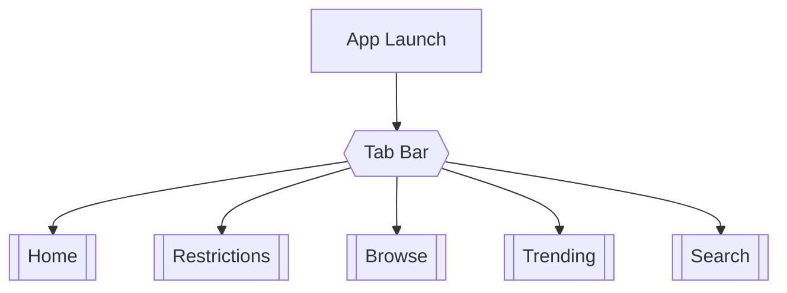
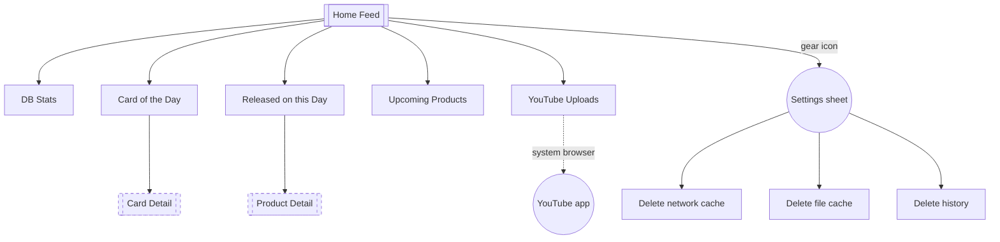
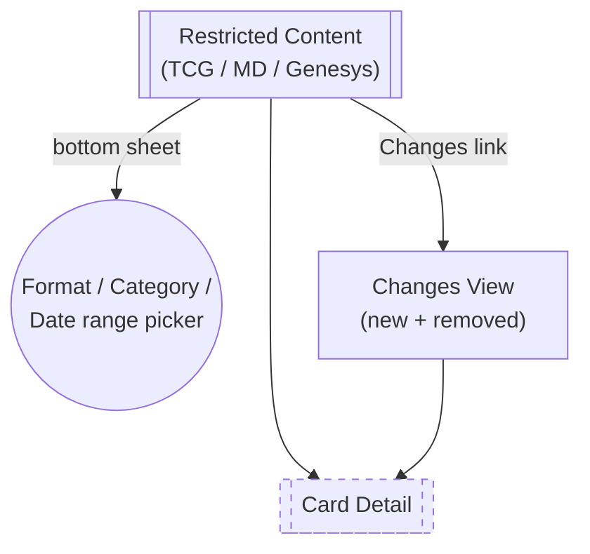
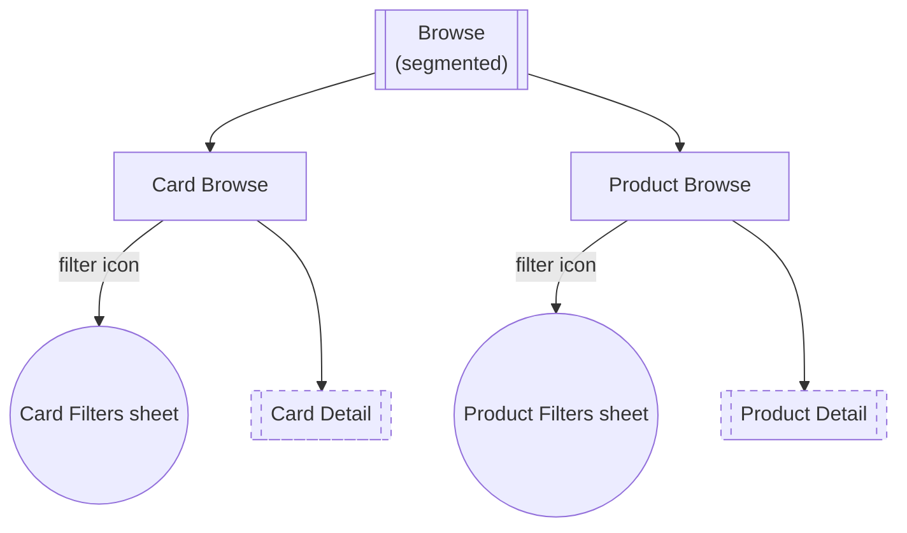
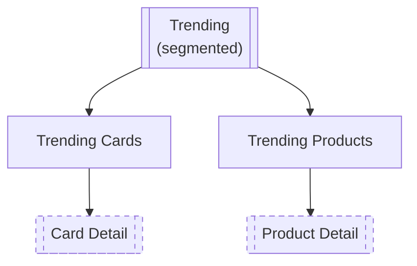
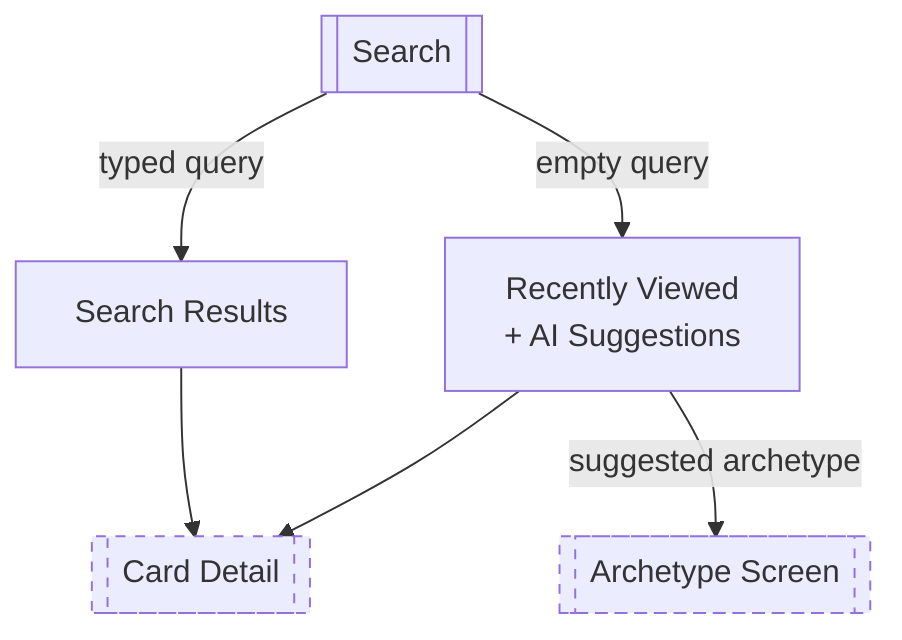
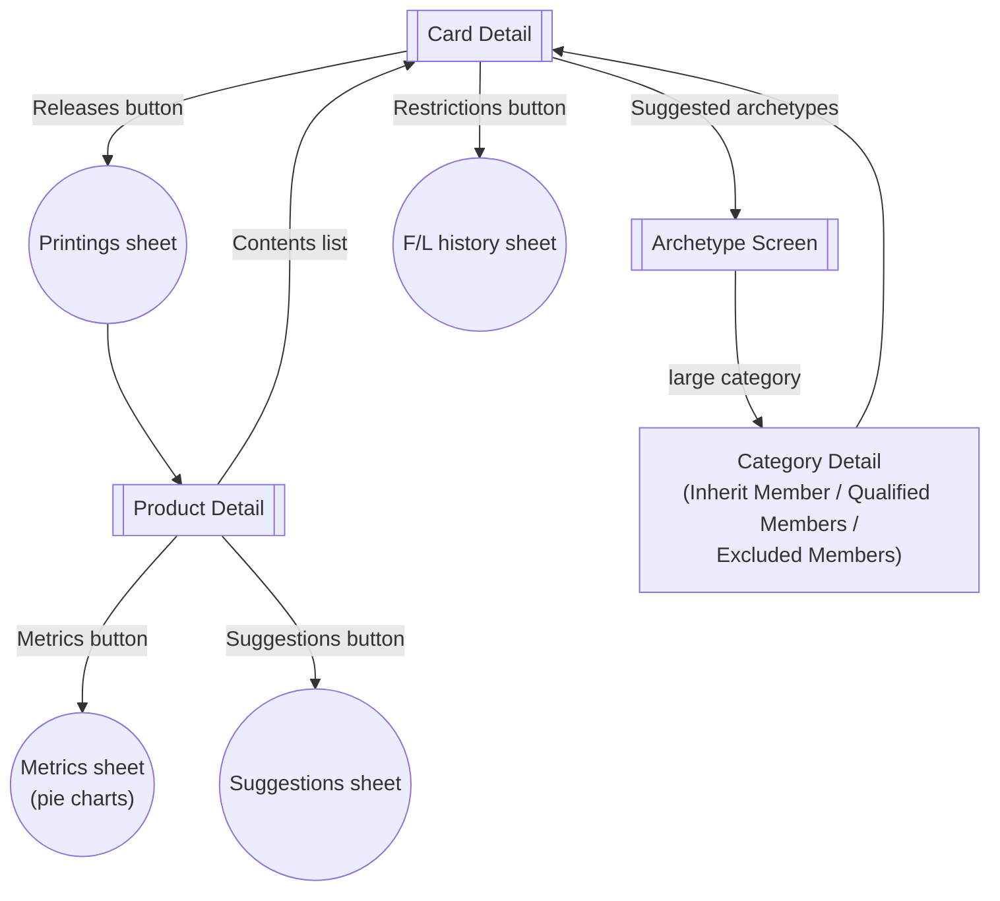

# SKC — UI Navigation Map

This diagram complements [FEATURES.md](FEATURES.md) with a visual map of how the app's screens,
tabs, and sheets connect. Rather than one large flowchart, the map is split into one diagram per
tab plus a shared diagram for the two hub screens (**Card Detail**, **Product Detail**) that
almost every tab eventually routes into — splitting it this way keeps each diagram readable
instead of one dense graph with long crossing edges.

Rounded/stadium nodes are modal sheets or popovers; rectangular nodes are pushed navigation
destinations; the double-bordered "subroutine" nodes are full screens; dashed nodes are **stubs**
— the same screen shown fully expanded in the [Card & Product Detail](#card--product-detail-hub)
diagram at the bottom.

## App shell

Each tab owns its own `NavigationStack` — a card/product pushed from one tab doesn't affect the
others' back-stacks.

## Home tab

## Restrictions tab

## Browse tab

## Trending tab

## Search tab

## Card & Product Detail hub

The two screens nearly every tab above routes into, plus the Archetype screen they both link to.
This is the part of the map worth studying closely — it's where deep-linking and cross-navigation
between cards, products, and archetypes actually happens.

## Reading the map

- **Stub nodes** (dashed `Card Detail`/`Product Detail`) mark where a tab hands off to one of the
  two hub screens. Their internal navigation isn't redrawn per tab — it's expanded once, in the
  [hub diagram](#card--product-detail-hub) above, since almost every tab (Home, Browse, Trending,
  Search, Restrictions, Archetypes) eventually routes into one or the other.
- **Sheets/popovers** (stadium shapes) are transient overlays — the Settings panel, filter panels,
  the restriction format/date navigator, and the card/product metrics & suggestions panels — that
  return to the screen that presented them rather than pushing a new stack entry.
- Not pictured, to avoid diagram clutter: `Card Detail`'s own "suggestions" carousel can link to
  *other* cards, re-entering the same screen type with a different card ID.
